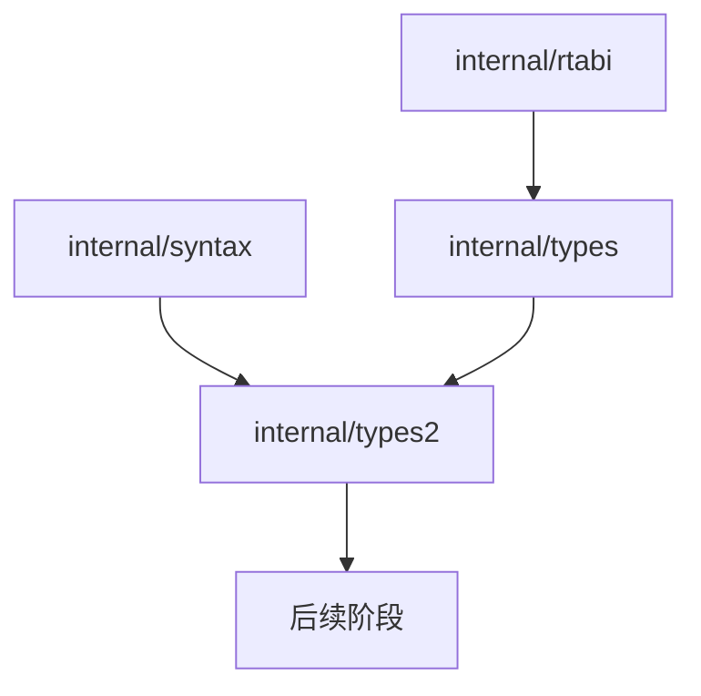
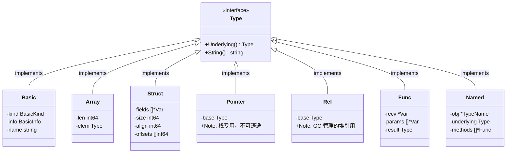
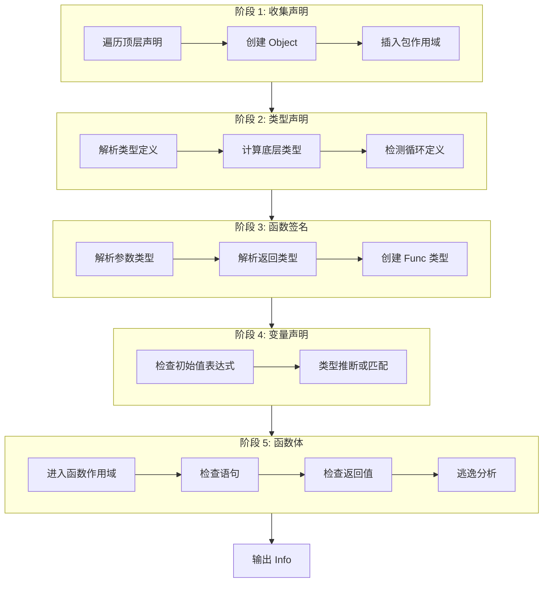
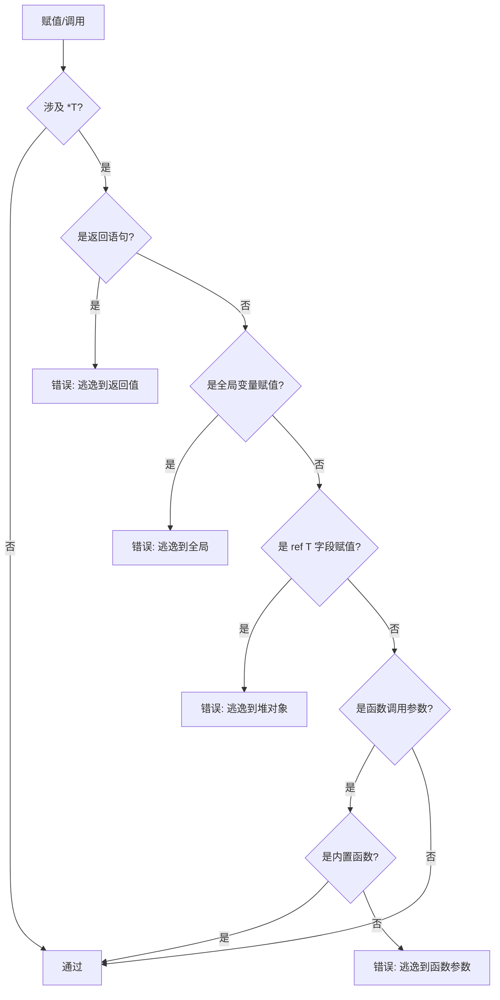

# Phase 3: 类型系统与语义分析 设计文档

## 概述

Phase 3 是 Yoru 编译器前端最复杂的阶段，负责将语法结构（AST）转换为带有语义信息的 Typed AST。本阶段实现类型系统、名称解析、类型检查、常量折叠以及 `*T` 逃逸分析。

### 设计目标

1. **类型安全**：确保程序中所有表达式和操作的类型正确性
2. **内存安全**：通过 `*T` 逃逸分析防止 Use-After-Free
3. **ABI 一致性**：类型布局与 `rtabi` 常量和 C runtime 保持一致
4. **良好诊断**：提供清晰的错误消息，支持错误恢复以报告多个错误

### 参考资料

- Go 编译器 `cmd/compile/internal/types2/` 包
- Go 编译器 `cmd/compile/internal/types/` 包
- 项目设计文档 `docs/yoru-compiler-design.md`

---

## 1. 目录结构

遵循 Go 编译器的设计，将**类型表示**与**类型检查**分离到两个包：

```
internal/
├── types/                  # 类型表示（无 AST 依赖）
│   ├── type.go            # Type 接口和基础实现
│   ├── basic.go           # 基本类型 (int, float, bool, string)
│   ├── composite.go       # 复合类型 (Array, Struct, Pointer, Ref, Func)
│   ├── object.go          # 对象定义 (Var, TypeName, FuncObj, Builtin, Nil)
│   ├── scope.go           # 作用域和符号表
│   ├── universe.go        # 预声明类型、常量、函数
│   ├── sizes.go           # ABI 兼容的大小/对齐计算
│   ├── predicates.go      # 类型谓词 (Identical, AssignableTo 等)
│   └── package.go         # Package 表示
│
├── types2/                 # 类型检查（语义分析）
│   ├── api.go             # 公共 API (Check, Config, Info)
│   ├── check.go           # Checker 结构和主入口
│   ├── resolver.go        # 名称解析和作用域构建
│   ├── decl.go            # 声明检查
│   ├── typexpr.go         # 类型表达式解析
│   ├── expr.go            # 表达式类型检查
│   ├── const.go           # 常量表达式求值
│   ├── stmt.go            # 语句检查
│   ├── call.go            # 函数/方法调用检查
│   ├── operand.go         # 操作数表示
│   ├── assignments.go     # 赋值兼容性检查
│   ├── escape.go          # *T 逃逸分析
│   └── errors.go          # 错误报告基础设施
```

### 包依赖关系



**设计理由**：
- `types` 包是纯数据结构，可被 SSA、codegen 等后续阶段使用
- `types2` 包依赖 `syntax`（AST）和 `types`，专注于语义分析
- 分离使得类型表示可以独立测试和复用

**syntax 包扩展需求**：
Phase 3 需要在 `syntax` 包添加以下判定方法（避免导出内部 Token 常量）：

```go
// internal/syntax/token.go 新增方法
func (t Token) IsDefine() bool { return t == _Define }  // 判断 :=
func (t Token) IsAssign() bool { return t == _Assign }  // 判断 =
```

---

## 2. 类型系统设计

### 2.1 Type 接口

所有类型实现统一的 `Type` 接口：

```go
// Type 是所有类型的基础接口
type Type interface {
    // Underlying 返回底层类型
    // 对于 Named 类型返回其定义的类型，其他类型返回自身
    Underlying() Type

    // String 返回人类可读的类型表示
    String() string

    // aType 是包私有标记方法，限制实现
    aType()
}
```

### 2.2 类型种类



### 2.3 Basic 类型

基本类型包括具体类型和 untyped 类型：

| BasicKind | Info 标志 | 说明 |
|-----------|----------|------|
| `Int` | IsInteger, IsNumeric | 64 位有符号整数 |
| `Float` | IsFloat, IsNumeric | 64 位浮点数 |
| `Bool` | IsBoolean | 布尔值 |
| `String` | IsString | 字符串 |
| `UntypedBool` | IsBoolean, IsUntyped | `true`, `false` 字面量 |
| `UntypedInt` | IsInteger, IsNumeric, IsUntyped | 整数字面量 `42` |
| `UntypedFloat` | IsFloat, IsNumeric, IsUntyped | 浮点字面量 `3.14` |
| `UntypedString` | IsString, IsUntyped | 字符串字面量 `"hello"` |
| `UntypedNil` | IsUntyped | `nil` 字面量 |

**Untyped 常量转换规则**：
- Untyped 常量可隐式转换为兼容的具体类型
- `UntypedInt` → `Int` 或 `Float`
- `UntypedFloat` → `Float`
- `UntypedBool` → `Bool`
- `UntypedString` → `String`
- `UntypedNil` → 任何 `*T` 或 `ref T`

### 2.4 Pointer vs Ref

Yoru 区分两种指针类型以确保内存安全：

| 特性 | `*T` (Pointer) | `ref T` (Ref) |
|------|---------------|---------------|
| 创建方式 | `&local` | `new(T)` |
| 生命周期 | 栈帧内 | GC 管理 |
| 可为 nil | 是 | 是 |
| 可逃逸 | **禁止** | 允许 |
| 用途 | 函数内临时借用 | 长期存活的堆对象 |

**关键规则**：
- `ref T → *T` 转换**禁止**（编译错误）
- `*T` 不能返回、不能赋值给全局、不能存入堆对象字段

---

## 3. Object 系统

Object 表示程序中声明的实体（变量、类型、函数等）。

### 3.1 Object 接口

```go
// Object 是所有声明实体的基础接口
type Object interface {
    Name() string       // 对象名称
    Type() Type         // 对象类型
    Pos() syntax.Pos    // 声明位置
    Parent() *Scope     // 所在作用域

    setParent(*Scope)   // 内部使用
    aObject()           // 包私有标记
}
```

### 3.2 Object 种类

| 类型 | 说明 | 示例 |
|------|------|------|
| `*Var` | 变量或结构体字段 | `var x int`, 结构体的 `field` |
| `*TypeName` | 类型名 | `type Point struct {...}` |
| `*FuncObj` | 函数或方法 | `func foo()`, `func (r *T) M()` |
| `*Builtin` | 内置函数 | `println`, `new`, `panic` |
| `*Nil` | nil 值 | `nil` |

### 3.3 Builtin 函数

| 名称 | 签名 | 说明 |
|------|------|------|
| `println` | `func(args...)` | 打印参数，支持 int, float, bool, string |
| `new` | `func(T) ref T` | 分配堆内存，返回 GC 管理的引用 |
| `panic` | `func(string)` | 终止程序，打印错误消息 |

---

## 4. 作用域系统

### 4.1 Scope 结构

```go
type Scope struct {
    parent   *Scope              // 父作用域
    children []*Scope            // 子作用域列表
    elems    map[string]Object   // 名称 → 对象映射
    pos, end syntax.Pos          // 作用域范围
    comment  string              // 调试注释
}
```

### 4.2 作用域层次

```
Universe (int, float, bool, string, true, false, nil, println, new, panic)
    │
    └── Package "main" (顶层声明：类型、变量、函数)
            │
            ├── Function "foo" (参数)
            │       │
            │       └── Block (局部变量)
            │               │
            │               └── Block (嵌套块)
            │
            └── Function "bar" (参数)
                    └── ...
```

### 4.3 名称查找规则

```go
// LookupParent 从当前作用域向上查找名称
func (s *Scope) LookupParent(name string) (Object, *Scope) {
    for scope := s; scope != nil; scope = scope.parent {
        if obj := scope.elems[name]; obj != nil {
            return obj, scope
        }
    }
    return nil, nil
}
```

**查找顺序**：当前块 → 外层块 → 函数参数 → 包级 → Universe

### 4.4 重复声明检查

```go
// Insert 插入对象，返回已存在的同名对象（如有冲突）
func (s *Scope) Insert(obj Object) Object {
    name := obj.Name()
    if existing := s.elems[name]; existing != nil {
        return existing  // 名称冲突
    }
    s.elems[name] = obj
    obj.setParent(s)
    return nil
}
```

---

## 5. 类型检查流程

### 5.1 整体流程



### 5.2 Checker 结构

```go
type Checker struct {
    conf    *Config          // 配置（错误处理器、Sizes）
    info    *Info            // 收集的类型信息
    pkg     *types.Package   // 当前包

    // 检查上下文
    scope   *types.Scope     // 当前作用域
    pos     syntax.Pos       // 当前位置（用于错误报告）

    // 函数上下文
    funcSig *types.Func      // 当前函数签名
    hasReturn bool           // 是否有显式 return

    // 逃逸分析
    escapeCtx *escapeContext

    // 错误跟踪
    errors  int              // 错误计数
    first   error            // 第一个错误
}
```

### 5.3 Info 结构（类型信息输出）

```go
type Info struct {
    // Types 记录每个表达式的类型
    Types map[syntax.Expr]TypeAndValue

    // Defs 记录定义：标识符 → 定义的对象
    Defs map[*syntax.Name]types.Object

    // Uses 记录引用：标识符 → 引用的对象
    Uses map[*syntax.Name]types.Object

    // Scopes 记录 AST 节点 → 作用域
    Scopes map[syntax.Node]*types.Scope
}

type TypeAndValue struct {
    Type  types.Type      // 表达式类型
    Value constant.Value  // 常量值（如适用）
    mode  operandMode     // 操作数模式
}
```

---

## 6. 表达式类型检查

### 6.1 Operand 表示

`operand` 表示表达式求值的结果：

```go
type operandMode int

const (
    invalid   operandMode = iota  // 无效
    novalue                       // 无值（void 函数调用）
    builtin                       // 内置函数
    typexpr                       // 类型表达式
    constant_                     // 常量
    variable                      // 可寻址的变量
    value                         // 计算值（不可寻址）
)

type operand struct {
    mode operandMode
    pos  syntax.Pos
    typ  types.Type
    val  constant.Value  // 常量值
    expr syntax.Expr     // 源表达式
}
```

### 6.2 表达式检查分派

```go
func (c *Checker) exprInternal(x *operand, e syntax.Expr) {
    switch e := e.(type) {
    case *syntax.Name:
        c.ident(x, e)

    case *syntax.BasicLit:
        c.basicLit(x, e)

    case *syntax.Operation:
        if e.Y == nil {
            c.unary(x, e)
        } else {
            c.binary(x, e)
        }

    case *syntax.CallExpr:
        c.call(x, e)

    case *syntax.IndexExpr:
        c.index(x, e)

    case *syntax.SelectorExpr:
        c.selector(x, e)

    case *syntax.NewExpr:
        c.newExpr(x, e)

    case *syntax.CompositeLit:
        c.compositeLit(x, e)

    case *syntax.ParenExpr:
        c.exprInternal(x, e.X)

    // 类型表达式
    case *syntax.ArrayType, *syntax.PointerType,
         *syntax.RefType, *syntax.StructType:
        c.typExpr(x, e)
    }

    c.recordType(e, x)
}
```

### 6.3 运算符类型规则

**算术运算符** (`+`, `-`, `*`, `/`, `%`):
- 两个操作数必须是数值类型
- 结果类型与操作数类型相同
- `%` 仅适用于整数

**比较运算符** (`==`, `!=`, `<`, `<=`, `>`, `>=`):
- 操作数类型必须可比较
- 结果类型为 `bool`
- 有序比较 (`<`, `<=`, `>`, `>=`) 仅适用于数值和字符串

**逻辑运算符** (`&&`, `||`, `!`):
- 操作数必须是布尔类型
- 结果类型为 `bool`

**取地址** (`&`):
- 操作数必须可寻址（变量、索引、选择器）
- 结果类型为 `*T`

**解引用** (`*`):
- 操作数必须是 `*T` 或 `ref T`
- 结果类型为 `T`

---

## 7. 常量求值

> **与 SSA 优化的关系**：常量求值是**类型检查的必要组成部分**，不是 AST 级优化。
> 根据总体规划，"优化集中在 SSA 层，AST/Typed AST 只做 desugar"。
>
> 常量求值的目的是：
> 1. **数组长度**：`[1+2]int` 需要在编译期确定长度为 3
> 2. **常量声明**：计算并记录常量值供后续使用
> 3. **类型检查**：判断常量是否可表示为目标类型（如溢出检测）
>
> Phase 3 **不会**对 AST 做常量替换/改写优化，只在 `Info.Types` 中记录常量值。
> 真正的优化（如常量传播）在 SSA 阶段进行。

### 7.1 常量表达式求值

常量求值在类型检查时计算常量表达式的值（用于数组长度、类型检查等）：

```go
func (c *Checker) constExpr(x *operand, e syntax.Expr) {
    c.exprInternal(x, e)

    if x.mode != constant_ {
        return  // 非常量表达式
    }

    // 对于二元运算，如果两个操作数都是常量，计算结果
    if op, ok := e.(*syntax.Operation); ok && op.Y != nil {
        var y operand
        c.exprInternal(&y, op.Y)

        if x.mode == constant_ && y.mode == constant_ {
            x.val = c.evalBinaryOp(x.val, op.Op, y.val)
        }
    }
}
```

### 7.2 支持的常量运算

| 运算 | 示例 | 结果类型 |
|------|------|----------|
| 算术 | `1 + 2` | untyped int (3) |
| 比较 | `1 < 2` | untyped bool (true) |
| 逻辑 | `true && false` | untyped bool (false) |
| 字符串连接 | `"a" + "b"` | untyped string ("ab") |
| 一元 | `-42`, `!true` | untyped int/bool |

### 7.3 常量溢出处理

```go
func (c *Checker) evalBinaryOp(x, y constant.Value, op syntax.Token) constant.Value {
    result := constant.BinaryOp(x, tokenToOp(op), y)

    // 检查整数溢出
    if constant.Sign(result) != 0 {
        if v, ok := constant.Int64Val(result); !ok || v > math.MaxInt64 || v < math.MinInt64 {
            c.errorf(pos, "constant overflow")
        }
    }

    return result
}
```

---

## 8. 语句检查

### 8.1 语句检查分派

```go
func (c *Checker) stmt(s syntax.Stmt) {
    switch s := s.(type) {
    case *syntax.BlockStmt:
        c.openScope(s, "block")
        for _, stmt := range s.Stmts {
            c.stmt(stmt)
        }
        c.closeScope()

    case *syntax.IfStmt:
        c.ifStmt(s)

    case *syntax.ForStmt:
        c.forStmt(s)

    case *syntax.ReturnStmt:
        c.returnStmt(s)

    case *syntax.AssignStmt:
        c.assignStmt(s)

    case *syntax.ExprStmt:
        c.exprStmt(s)

    case *syntax.DeclStmt:
        c.declStmt(s)

    case *syntax.BranchStmt:
        c.branchStmt(s)

    case *syntax.EmptyStmt:
        // 无操作
    }
}
```

### 8.2 赋值语句检查

```go
func (c *Checker) assignStmt(s *syntax.AssignStmt) {
    if len(s.LHS) != len(s.RHS) {
        c.errorf(s.Pos(), "assignment mismatch: %d variables but %d values",
                 len(s.LHS), len(s.RHS))
        return
    }

    for i := range s.LHS {
        var lhs, rhs operand

        if s.Op.IsDefine() {  // :=  (需要在 syntax.Token 添加 IsDefine() 方法)
            c.shortVarDecl(s.LHS[i], s.RHS[i])
        } else {  // =
            c.exprInternal(&lhs, s.LHS[i])
            c.exprInternal(&rhs, s.RHS[i])

            if lhs.mode != variable {
                c.errorf(s.LHS[i].Pos(), "cannot assign to %s", s.LHS[i])
                continue
            }

            c.assignment(&rhs, lhs.typ, "assignment")

            // 逃逸检查
            if _, isPtr := rhs.typ.Underlying().(*types.Pointer); isPtr {
                c.checkPointerEscape(s.LHS[i], &rhs)
            }
        }
    }
}
```

### 8.3 短变量声明 (`:=`)

```go
func (c *Checker) shortVarDecl(lhs syntax.Expr, rhs syntax.Expr) {
    name, ok := lhs.(*syntax.Name)
    if !ok {
        c.errorf(lhs.Pos(), "non-name on left side of :=")
        return
    }

    var x operand
    c.exprInternal(&x, rhs)

    // 推断类型
    typ := x.typ
    if isUntyped(typ) {
        typ = defaultType(typ)
    }

    // 创建变量
    obj := types.NewVar(name.Pos(), name.Value, typ)
    c.declare(name, obj)
}

// defaultType 返回 untyped 类型的默认具体类型
func defaultType(typ types.Type) types.Type {
    if basic, ok := typ.(*types.Basic); ok {
        switch basic.Kind() {
        case types.UntypedBool:
            return types.Typ[types.Bool]
        case types.UntypedInt:
            return types.Typ[types.Int]
        case types.UntypedFloat:
            return types.Typ[types.Float]
        case types.UntypedString:
            return types.Typ[types.String]
        }
    }
    return typ
}
```

---

## 9. 逃逸分析 (`*T` 安全检查)

### 9.1 设计目标

`*T` 指针只能指向当前栈帧中的对象，禁止逃逸到：
1. 函数返回值
2. 全局变量
3. 堆对象（`ref T`）的字段
4. **函数调用参数**（v1 保守规则）

> **v1 保守规则**：由于 Yoru 目前不支持逃逸注解（如 Go 的 `//go:noescape`），
> Phase 3 采用保守策略：**禁止将 `*T` 作为参数传递给任何函数调用**。
> 这避免了被调用函数将指针存储到全局或堆的风险。
>
> 例外：内置函数 `println` 可以接受 `*T`（已知不会保存指针）。
>
> 后期可考虑：
> - 添加 `@noescape` 参数注解
> - 实现跨函数逃逸分析

### 9.2 检测规则



### 9.3 实现细节

```go
// checkPointerEscape 检查 *T 是否逃逸到禁止的位置
func (c *Checker) checkPointerEscape(lhs syntax.Expr, rhs *operand) {
    // 检查 1: 全局变量
    if name, ok := lhs.(*syntax.Name); ok {
        if obj := c.resolve(name); obj != nil {
            if obj.Parent() == c.pkg.Scope() {
                c.errorf(lhs.Pos(),
                    "*T cannot escape to global variable %s", name.Value)
                return
            }
        }
    }

    // 检查 2: ref T 的字段
    if sel, ok := lhs.(*syntax.SelectorExpr); ok {
        var base operand
        c.exprInternal(&base, sel.X)
        if isRefType(base.typ) {
            c.errorf(lhs.Pos(),
                "*T cannot escape to heap object field")
            return
        }
    }

    // 检查 3: ref T 的数组元素
    if idx, ok := lhs.(*syntax.IndexExpr); ok {
        c.checkIndexPointerEscape(idx)
    }
}

// checkCallArgEscape 检查函数调用参数中的 *T 逃逸（v1 保守规则）
func (c *Checker) checkCallArgEscape(call *syntax.CallExpr, args []*operand) {
    // 检查被调用者是否是内置函数
    isBuiltin := false
    if name, ok := call.Fun.(*syntax.Name); ok {
        if obj := c.resolve(name); obj != nil {
            _, isBuiltin = obj.(*types.Builtin)
        }
    }

    for i, arg := range args {
        if _, isPtr := arg.typ.Underlying().(*types.Pointer); isPtr {
            if !isBuiltin {
                c.errorf(call.Args[i].Pos(),
                    "*T cannot be passed to function (may escape); use ref T for heap data")
            }
        }
    }
}

// checkReturnEscape 检查返回语句是否返回 *T
func (c *Checker) checkReturnEscape(s *syntax.ReturnStmt) {
    if s.Result == nil {
        return
    }

    var x operand
    c.exprInternal(&x, s.Result)

    if _, isPtr := x.typ.Underlying().(*types.Pointer); isPtr {
        c.errorf(s.Pos(),
            "cannot return *T from function (use ref T for heap allocation)")
    }
}
```

### 9.4 禁止 `ref T → *T` 转换

```go
func (c *Checker) checkAssignment(rhs *operand, lhsType types.Type) {
    // 检查 ref T → *T 转换
    if _, isLhsPtr := lhsType.Underlying().(*types.Pointer); isLhsPtr {
        if _, isRhsRef := rhs.typ.Underlying().(*types.Ref); isRhsRef {
            c.errorf(rhs.pos,
                "cannot convert ref %s to *%s (would cause use-after-free)",
                rhs.typ, lhsType)
        }
    }
}
```

### 9.5 错误示例

```yoru
// 示例 1: 返回 *T (错误)
func bad1() *int {
    var x int
    return &x  // ERROR: cannot return *T from function
}

// 示例 2: 赋值到全局 (错误)
var g *int
func bad2() {
    var x int
    g = &x     // ERROR: *T cannot escape to global variable g
}

// 示例 3: 赋值到堆对象字段 (错误)
type Box struct {
    ptr *int
}
func bad3() {
    var x int
    var b ref Box = new(Box)
    b.ptr = &x // ERROR: *T cannot escape to heap object field
}

// 示例 4: ref T → *T 转换 (错误)
func bad4(r ref int) {
    var p *int = r  // ERROR: cannot convert ref int to *int
}

// 示例 5: 传递 *T 到函数 (错误, v1 保守规则)
func store(p *int) { /* 可能存储到全局 */ }
func bad5() {
    var x int
    store(&x)      // ERROR: *T cannot be passed to function (may escape)
}

// 示例 6: 正确用法
func good() {
    var x int
    var p *int = &x  // OK: *T 在栈帧内使用
    *p = 42          // OK

    var r ref int = new(int)  // OK: 需要长期存活用 ref T
}
```

---

## 10. 方法解析

### 10.1 方法集规则

| 值类型 | 可调用的方法 |
|--------|-------------|
| `T` | 接收者为 `T` 的方法 |
| `*T` | 接收者为 `T` 或 `*T` 的方法 |
| `ref T` | 接收者为 `T` 或 `*T` 的方法（隐式解引用） |

### 10.2 自动取地址/解引用

**重要约束**：Yoru **不支持 method value / method expression**（如 `T.M`、`x.M` 作为一等函数）。
方法选择器 `x.M` 只能在调用语境 `x.M(...)` 中出现，不能单独作为表达式求值。

```go
// selector 处理字段访问（方法调用由 call.go 专门处理）
func (c *Checker) selector(x *operand, e *syntax.SelectorExpr) {
    c.exprInternal(x, e.X)

    // 尝试字段访问
    if field := c.lookupField(x.typ, e.Sel.Value); field != nil {
        x.mode = variable
        x.typ = field.Type()
        return
    }

    // 检查是否是方法（仅用于提供更好的错误消息）
    if method, _, _ := c.lookupMethod(x.typ, e.Sel.Value); method != nil {
        // 方法选择器不能单独使用，必须立即调用
        // 这个错误会在非调用语境下触发
        c.errorf(e.Pos(),
            "cannot use method %s.%s as value (method expressions not supported)",
            x.typ, e.Sel.Value)
        x.mode = invalid
        return
    }

    c.errorf(e.Sel.Pos(), "%s has no field or method %s", x.typ, e.Sel.Value)
}

// lookupMethod 查找方法，返回是否需要自动取地址/解引用
func (c *Checker) lookupMethod(T types.Type, name string) (*types.FuncObj, bool, bool) {
    var autoAddr, autoDeref bool

    // 解包指针/引用类型
    base := T
    switch t := T.Underlying().(type) {
    case *types.Pointer:
        base = t.Elem()
        autoDeref = true
    case *types.Ref:
        base = t.Elem()
        autoDeref = true
    }

    // 查找 Named 类型的方法
    named, ok := base.(*types.Named)
    if !ok {
        return nil, false, false
    }

    for i := 0; i < named.NumMethods(); i++ {
        m := named.Method(i)
        if m.Name() == name {
            // 检查接收者类型
            recv := m.Signature().Recv()
            if recv != nil {
                _, recvIsPtr := recv.Type().Underlying().(*types.Pointer)
                if recvIsPtr && !autoDeref {
                    // 值类型调用指针方法，需要自动取地址
                    autoAddr = true
                }
            }
            return m, autoAddr, autoDeref
        }
    }

    return nil, false, false
}

// methodCall 在 call.go 中处理方法调用（x.M(...) 语法）
// 这是唯一合法使用方法选择器的地方
func (c *Checker) methodCall(x *operand, call *syntax.CallExpr, sel *syntax.SelectorExpr) {
    c.exprInternal(x, sel.X)  // 求值接收者

    method, autoAddr, _ := c.lookupMethod(x.typ, sel.Sel.Value)
    if method == nil {
        c.errorf(sel.Sel.Pos(), "%s has no method %s", x.typ, sel.Sel.Value)
        return
    }

    // 检查自动取地址约束
    if autoAddr && x.mode != variable {
        c.errorf(sel.Pos(), "cannot call pointer method on non-addressable %s", x.typ)
        return
    }

    // 检查参数
    c.checkCallArgs(call, method.Signature())

    // 设置返回类型
    x.mode = value
    x.typ = method.Signature().Result()
}
```

---

## 11. 大小和布局计算

### 11.1 Sizes 实现

```go
// Sizes 提供类型大小和对齐计算
// 使用 rtabi 常量确保 ABI 一致性
type Sizes struct{}

func (s *Sizes) Sizeof(T Type) int64 {
    switch t := T.Underlying().(type) {
    case *Basic:
        return s.basicSize(t.Kind())
    case *Array:
        return t.Len() * s.Sizeof(t.Elem())
    case *Struct:
        s.computeLayout(t)
        return t.Size()
    case *Pointer, *Ref, *Func:
        return rtabi.SizePtr
    }
    return 0
}

func (s *Sizes) Alignof(T Type) int64 {
    switch t := T.Underlying().(type) {
    case *Basic:
        return s.basicAlign(t.Kind())
    case *Array:
        return s.Alignof(t.Elem())
    case *Struct:
        s.computeLayout(t)
        return t.Align()
    case *Pointer, *Ref, *Func:
        return rtabi.AlignPtr
    }
    return 1
}
```

### 11.2 结构体布局算法

```go
func (s *Sizes) computeLayout(st *Struct) {
    if st.layoutDone {
        return
    }

    var offset int64
    var maxAlign int64 = 1
    st.offsets = make([]int64, len(st.fields))

    for i, f := range st.fields {
        fieldSize := s.Sizeof(f.Type())
        fieldAlign := s.Alignof(f.Type())

        // 对齐 offset
        offset = align(offset, fieldAlign)
        st.offsets[i] = offset
        offset += fieldSize

        if fieldAlign > maxAlign {
            maxAlign = fieldAlign
        }
    }

    st.align = maxAlign
    st.size = align(offset, maxAlign)  // 末尾填充
    st.layoutDone = true
}

func align(x, a int64) int64 {
    return (x + a - 1) &^ (a - 1)
}
```

### 11.3 布局示例

```
type Point struct {
    x int     // offset=0, size=8, align=8
    y int     // offset=8, size=8, align=8
}
// total: size=16, align=8

type Mixed struct {
    a bool    // offset=0, size=1, align=1
              // padding: 7 bytes
    b int     // offset=8, size=8, align=8
    c bool    // offset=16, size=1, align=1
              // padding: 7 bytes
}
// total: size=24, align=8

type Node struct {
    value int      // offset=0, size=8, align=8
    next  ref Node // offset=8, size=8, align=8
}
// total: size=16, align=8
```

---

## 12. 错误处理

### 12.1 错误报告机制

```go
// errorf 报告类型错误
func (c *Checker) errorf(pos syntax.Pos, format string, args ...interface{}) {
    msg := fmt.Sprintf(format, args...)

    if c.errors == 0 {
        c.first = &TypeError{Pos: pos, Msg: msg}
    }
    c.errors++

    // 调用配置的错误处理器
    if c.conf.Error != nil {
        c.conf.Error(pos, msg)
    }
}

type TypeError struct {
    Pos syntax.Pos
    Msg string
}

func (e *TypeError) Error() string {
    return fmt.Sprintf("%s: %s", e.Pos, e.Msg)
}
```

### 12.2 错误恢复策略

检查遇到错误后继续检查，以报告更多错误：

1. **表达式错误**：将操作数标记为 `invalid`，继续检查其他表达式
2. **语句错误**：跳过当前语句，继续检查后续语句
3. **声明错误**：记录错误，使用占位符类型继续

```go
func (c *Checker) exprInternal(x *operand, e syntax.Expr) {
    // ... 检查代码 ...

    // 错误恢复：确保 x 有有效状态
    if x.typ == nil {
        x.typ = types.Typ[types.Invalid]
    }
    if x.mode == 0 {
        x.mode = invalid
    }
}
```

### 12.3 错误消息格式

| 类别 | 格式 | 示例 |
|------|------|------|
| 未定义 | `undefined: NAME` | `undefined: foo` |
| 重复声明 | `NAME redeclared in this block` | `x redeclared in this block` |
| 类型不匹配 | `cannot use TYPE as TYPE in CONTEXT` | `cannot use int as string in assignment` |
| 无效操作 | `invalid operation: OP (TYPE)` | `invalid operation: + (bool)` |
| 逃逸 | `*T cannot escape to LOCATION` | `*T cannot escape to global variable g` |

---

## 13. CLI 集成

### 13.1 新增标志

```go
// cmd/yoruc/main.go
var (
    emitTypedAST = flag.Bool("emit-typed-ast", false, "output typed AST")
    emitLayout   = flag.Bool("emit-layout", false, "output struct layouts")
)
```

### 13.2 `-emit-typed-ast` 输出

遍历 AST，打印每个表达式的类型：

```
File
  PkgName: main
  Decls:
    FuncDecl
      Name: main (func())
      Body:
        DeclStmt
          VarDecl
            Name: x (int)
            Value: Operation + (int)
              X: BasicLit "1" (untyped int -> int)
              Y: BasicLit "2" (untyped int -> int)
        ExprStmt
          CallExpr (void)
            Fun: Name "println" (builtin)
            Args:
              Name "x" (int)
```

### 13.3 `-emit-layout` 输出

```
=== Struct Layouts ===

type Point struct {
    x int    // offset: 0, size: 8, align: 8
    y int    // offset: 8, size: 8, align: 8
}
// size: 16, align: 8

type Node struct {
    value int       // offset: 0, size: 8, align: 8
    next  ref Node  // offset: 8, size: 8, align: 8
}
// size: 16, align: 8
```

---

## 14. 测试策略

### 14.1 测试文件组织

```
internal/types/
├── types_test.go        # 类型构造测试
├── sizes_test.go        # 大小计算测试
└── scope_test.go        # 作用域测试

internal/types2/
├── check_test.go        # 集成测试
├── const_test.go        # 常量求值测试
├── escape_test.go       # 逃逸分析测试
└── testdata/
    ├── valid/           # 应通过的程序
    │   ├── basic.yoru
    │   ├── struct.yoru
    │   ├── func.yoru
    │   ├── method.yoru
    │   └── const.yoru
    ├── errors/          # 期望错误的程序
    │   ├── undefined.yoru
    │   ├── type_mismatch.yoru
    │   ├── escape_global.yoru
    │   ├── escape_return.yoru
    │   ├── escape_heap.yoru
    │   └── ref_to_ptr.yoru
    └── golden/          # Golden 输出
        ├── typed_ast.golden
        └── layout.golden
```

### 14.2 测试分类

| 类别 | 目标数量 | 描述 |
|------|---------|------|
| 未定义符号 | 20 | 未定义变量、函数、类型 |
| 类型不匹配 | 40 | 赋值、比较、算术类型错误 |
| 重复声明 | 10 | 同一作用域重复声明 |
| 无效操作 | 30 | 操作数类型错误 |
| 函数调用 | 20 | 参数数量、类型错误 |
| 方法调用 | 20 | 接收者类型、未定义方法 |
| *T 逃逸 | 30 | 返回、全局、堆字段逃逸 |
| ref → * 转换 | 10 | 显式和隐式转换 |
| 控制流 | 10 | 非布尔条件 |
| 声明错误 | 10 | 无效初始值 |
| **总计** | **200+** | |

### 14.3 Golden 测试实现

```go
func TestTypedASTGolden(t *testing.T) {
    files, _ := filepath.Glob("testdata/valid/*.yoru")
    for _, f := range files {
        t.Run(f, func(t *testing.T) {
            ast := parse(f)
            info := &types2.Info{}
            check(ast, info)

            got := formatTypedAST(ast, info)
            golden := strings.TrimSuffix(f, ".yoru") + ".typed.golden"

            if *update {
                os.WriteFile(golden, []byte(got), 0644)
                return
            }

            want, _ := os.ReadFile(golden)
            if got != string(want) {
                t.Errorf("mismatch:\n%s", diff(got, string(want)))
            }
        })
    }
}
```

### 14.4 错误测试实现（含位置断言）

错误测试文件格式（在注释中标注期望的错误**行号**和消息子串）：

```yoru
// testdata/errors/undefined.yoru
package main

func main() {
    println(x) // ERROR:5: undefined: x
}
```

```go
// ExpectedError 表示期望的错误
type ExpectedError struct {
    Line int    // 期望的行号
    Msg  string // 期望包含的消息子串
}

func TestErrors(t *testing.T) {
    files, _ := filepath.Glob("testdata/errors/*.yoru")
    for _, f := range files {
        t.Run(f, func(t *testing.T) {
            // 从注释提取期望错误（格式: // ERROR:行号: 消息）
            expected := extractExpectedErrors(f)

            var errors []struct {
                Line int
                Msg  string
            }
            conf := &types2.Config{
                Error: func(pos syntax.Pos, msg string) {
                    errors = append(errors, struct{ Line int; Msg string }{
                        Line: pos.Line(),
                        Msg:  msg,
                    })
                },
            }

            ast := parse(f)
            check(ast, conf)

            // 验证：必须匹配行号 + 消息子串
            for _, exp := range expected {
                found := false
                for _, got := range errors {
                    if got.Line == exp.Line && strings.Contains(got.Msg, exp.Msg) {
                        found = true
                        break
                    }
                }
                if !found {
                    t.Errorf("expected error at line %d containing %q not found",
                             exp.Line, exp.Msg)
                }
            }

            // 反向验证：不应有意外错误
            for _, got := range errors {
                matched := false
                for _, exp := range expected {
                    if got.Line == exp.Line && strings.Contains(got.Msg, exp.Msg) {
                        matched = true
                        break
                    }
                }
                if !matched {
                    t.Errorf("unexpected error at line %d: %s", got.Line, got.Msg)
                }
            }
        })
    }
}
```

### 14.5 CLI Golden 测试

测试 `-emit-typed-ast` 和 `-emit-layout` 的 CLI 输出：

```go
func TestCLIEmitTypedAST(t *testing.T) {
    files, _ := filepath.Glob("testdata/cli/*.yoru")
    for _, f := range files {
        t.Run(f, func(t *testing.T) {
            // 运行 yoruc -emit-typed-ast
            cmd := exec.Command("./build/yoruc", "-emit-typed-ast", f)
            got, err := cmd.Output()
            if err != nil {
                t.Fatalf("yoruc failed: %v", err)
            }

            golden := strings.TrimSuffix(f, ".yoru") + ".typed-ast.golden"
            if *update {
                os.WriteFile(golden, got, 0644)
                return
            }

            want, _ := os.ReadFile(golden)
            if string(got) != string(want) {
                t.Errorf("mismatch:\n%s", diff(string(got), string(want)))
            }
        })
    }
}

func TestCLIEmitLayout(t *testing.T) {
    // 类似实现，测试 -emit-layout 输出
}
```

### 14.6 Struct 布局对拍测试（与 clang 一致性）

确保编译器计算的 struct 布局与 clang 一致：

**测试方案**：生成 C 代码，用 clang 编译并输出 sizeof/offsetof，与编译器计算对比。

```go
func TestLayoutConsistency(t *testing.T) {
    // 测试用例定义
    cases := []struct {
        yoruType string
        cType    string
        fields   []string
    }{
        {
            yoruType: "type Point struct { x int; y int }",
            cType:    "struct Point { int64_t x; int64_t y; };",
            fields:   []string{"x", "y"},
        },
        {
            yoruType: "type Mixed struct { a bool; b int; c bool }",
            cType:    "struct Mixed { int8_t a; int64_t b; int8_t c; };",
            fields:   []string{"a", "b", "c"},
        },
    }

    for _, tc := range cases {
        t.Run(tc.yoruType, func(t *testing.T) {
            // 1. 编译器计算布局
            yoruSize, yoruAlign, yoruOffsets := computeYoruLayout(tc.yoruType)

            // 2. 生成 C 测试程序
            cCode := generateLayoutTest(tc.cType, tc.fields)

            // 3. 用 clang 编译运行，获取 sizeof/offsetof
            clangSize, clangAlign, clangOffsets := runClangLayoutTest(cCode)

            // 4. 对比
            if yoruSize != clangSize {
                t.Errorf("size mismatch: yoru=%d, clang=%d", yoruSize, clangSize)
            }
            if yoruAlign != clangAlign {
                t.Errorf("align mismatch: yoru=%d, clang=%d", yoruAlign, clangAlign)
            }
            for i, name := range tc.fields {
                if yoruOffsets[i] != clangOffsets[i] {
                    t.Errorf("offset[%s] mismatch: yoru=%d, clang=%d",
                             name, yoruOffsets[i], clangOffsets[i])
                }
            }
        })
    }
}

// generateLayoutTest 生成 C 测试程序
func generateLayoutTest(cType string, fields []string) string {
    var buf strings.Builder
    buf.WriteString("#include <stdint.h>\n")
    buf.WriteString("#include <stddef.h>\n")
    buf.WriteString("#include <stdio.h>\n")
    buf.WriteString(cType + "\n")
    buf.WriteString("int main() {\n")
    buf.WriteString("  printf(\"%zu %zu\\n\", sizeof(struct Point), _Alignof(struct Point));\n")
    for _, f := range fields {
        fmt.Fprintf(&buf, "  printf(\"%%zu\\n\", offsetof(struct Point, %s));\n", f)
    }
    buf.WriteString("  return 0;\n}\n")
    return buf.String()
}
```

**CI 集成**：在 `make layout-test` 中运行此测试，确保每次修改布局计算都能及时发现问题。

---

## 15. Phase 3 输出规范（Phase 4 交接契约）

Phase 3 的输出是 **Typed AST + Info**，供 Phase 4（SSA 生成）直接消费。
以下明确哪些语义已在 Phase 3 固化，Phase 4 无需重复推导。

### 15.1 Info 结构内容

| 字段 | 内容 | Phase 4 用法 |
|------|------|-------------|
| `Types` | 每个 `Expr` 的类型和值 | 生成 SSA Value 时确定类型 |
| `Defs` | 定义处的 `Name → Object` | 创建 SSA 变量 |
| `Uses` | 引用处的 `Name → Object` | 查找 SSA 变量 |
| `Scopes` | AST 节点 → Scope | 管理 SSA 变量命名空间 |

### 15.2 已固化的语义（Phase 4 可直接使用）

| 语义 | 固化内容 | 说明 |
|------|---------|------|
| **类型信息** | 所有 Expr 有确定类型 | `Info.Types[expr].Type` |
| **常量值** | 常量表达式的求值结果 | `Info.Types[expr].Value` |
| **符号绑定** | 名称已解析到 Object | `Info.Uses[name]` |
| **方法决议** | 方法调用已解析到具体方法 | 通过 selector 的 Object |
| **自动解引用** | `ref T` 调用方法的隐式解引用 | SSA 生成时插入 Load |
| **自动取地址** | `T` 调用 `*T` 方法的隐式取地址 | SSA 生成时插入 Addr |
| **布局信息** | Struct 的 size/align/offsets | `types.Struct.Size()` 等 |

### 15.3 Typed AST 节点注解

部分 AST 节点在类型检查后携带额外信息：

```go
// TypeAndValue 记录在 Info.Types 中
type TypeAndValue struct {
    Type  types.Type      // 表达式的类型
    Value constant.Value  // 常量值（如适用）
    mode  operandMode     // variable/value/constant_/builtin 等
}
```

**mode 含义**：
- `variable`: 可寻址，可作为赋值左值，SSA 生成时可能需要 Addr/Load
- `value`: 不可寻址，只能读取
- `constant_`: 编译期常量，SSA 可直接用立即数
- `builtin`: 内置函数，SSA 需特殊处理

### 15.4 Phase 4 不需要处理的事项

Phase 4（SSA 生成）可以假设：
- ✅ 所有表达式类型正确，无需再次类型检查
- ✅ 所有名称已解析，直接使用 `Info.Uses`
- ✅ `*T` 逃逸已检查，无需再次分析
- ✅ `ref T → *T` 转换不存在
- ✅ 方法调用已决议，无需再次查找方法集

### 15.5 Phase 4 需要处理的事项

SSA 生成仍需处理：
- 控制流图 (CFG) 构建
- Phi 节点插入
- 复合值（struct、array）的标量化或内存表示选择
- `new(T)` 调用降级为 `rt_alloc`
- 自动解引用/取地址的 SSA 指令生成

---

## 16. 子阶段实现计划

### Phase 3a: 类型表示与作用域

**任务清单：**
- [ ] `internal/types/type.go` - Type 接口
- [ ] `internal/types/basic.go` - Basic 类型
- [ ] `internal/types/composite.go` - 复合类型
- [ ] `internal/types/object.go` - Object 系统
- [ ] `internal/types/scope.go` - Scope 实现
- [ ] `internal/types/universe.go` - Universe 预声明
- [ ] `internal/types/sizes.go` - 大小计算
- [ ] `internal/types/package.go` - Package 表示
- [ ] 单元测试：类型构造、作用域操作、大小计算

**验收标准：**
- 所有类型可正确构造和打印
- Scope.Lookup/LookupParent 正确工作
- Universe 包含所有预声明实体
- 大小/对齐与 rtabi 常量一致（测试验证）

### Phase 3b: 类型检查核心

**任务清单：**
- [ ] `internal/types2/api.go` - 公共 API
- [ ] `internal/types2/check.go` - Checker 主入口
- [ ] `internal/types2/operand.go` - Operand 表示
- [ ] `internal/types2/errors.go` - 错误报告
- [ ] `internal/types2/resolver.go` - 名称解析
- [ ] `internal/types2/typexpr.go` - 类型表达式解析
- [ ] `internal/types2/expr.go` - 表达式检查
- [ ] `internal/types2/const.go` - 常量折叠
- [ ] 测试：表达式类型、名称解析、常量求值

**验收标准：**
- 可解析嵌套作用域中的名称
- 基本表达式类型检查正确
- 常量求值正确（`[1+2]int` 数组长度求值为 3）
- 类型不匹配被检测

### Phase 3c: 语句与声明

**任务清单：**
- [ ] `internal/types2/stmt.go` - 语句检查
- [ ] `internal/types2/decl.go` - 声明检查
- [ ] `internal/types2/assignments.go` - 赋值检查
- [ ] `internal/types2/call.go` - 调用检查
- [ ] 测试：语句、声明、方法调用

**验收标准：**
- 所有语句类型正确检查
- `:=` 推断工作正常
- 方法调用（含自动解引用）正常

### Phase 3d: 逃逸分析与安全

**任务清单：**
- [ ] `internal/types2/escape.go` - 逃逸分析
- [ ] CLI 集成：`-emit-typed-ast`, `-emit-layout`
- [ ] Golden 测试文件
- [ ] 200+ 错误测试用例

**验收标准：**
- *T 逃逸到全局被检测
- *T 逃逸到返回值被检测
- *T 逃逸到堆字段被检测
- ref T → *T 转换被拒绝
- CLI 输出正确

---

## 16. 验收标准总结

| 指标 | 目标 |
|------|------|
| 类型错误测试用例 | 200+ |
| 逃逸检测准确率 | 100%（无漏报）|
| ref → * 转换拒绝率 | 100% |
| *T 逃逸拒绝率 | 100% |
| 常量求值正确性（数组长度等） | 100% |
| 结构体布局与 rtabi 一致性 | 100% |
| `-emit-typed-ast` 覆盖率 | 所有 Expr 节点 |
| `-emit-layout` 准确性 | 与 clang 一致 |
| 错误恢复 | 单文件报告多个错误 |

---

## 附录 A: 类型兼容性规则

### A.1 相同类型 (Identical)

两个类型相同当且仅当：
- 都是同一个 Basic 类型
- 都是 Array 且长度相同、元素类型相同
- 都是 Struct 且字段数量、名称、类型都相同
- 都是 Pointer 且基础类型相同
- 都是 Ref 且基础类型相同
- 都是 Func 且签名相同
- 都是同一个 Named 类型

### A.2 可赋值 (Assignable)

`x` 可赋值给类型 `T` 当：
- `x` 的类型与 `T` 相同
- `x` 是 untyped 常量且可表示为 `T`
- `T` 是 `*T` 或 `ref T` 且 `x` 是 `nil`

**禁止的赋值：**
- `ref T` → `*T`（编译错误）
- `*T` 赋值到全局/返回值/堆字段（逃逸错误）

---

## 附录 B: Untyped 常量默认类型

| Untyped 类型 | 默认类型 |
|-------------|---------|
| `UntypedBool` | `bool` |
| `UntypedInt` | `int` |
| `UntypedFloat` | `float` |
| `UntypedString` | `string` |
| `UntypedNil` | 无（必须有上下文类型）|
